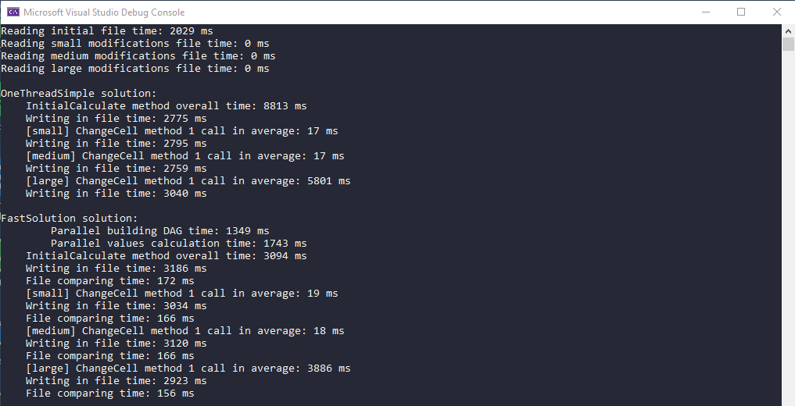

# Spreadsheet computation engine

## Problem description
A big project for the computation team is to build a spreadsheet computation engine. Engine is written in a system language (C++ or Rust) and is embedded both into the Frontend (via WebAssembly), native platforms (desktop, mobile) and Backend.

The task is to write a toy computation algorithm that parses the input file (input.txt), calculates the values of all of the cells and outputs their values into an output file.

There is a high potential for parallelism in this task. **Needs to implement an algorithm, that spreads calculation across multiple threads.** This parallelization is the main algorithm that is implemented. It's not that trivial to implement, but this is what makes this task interesting. The main use case to be optimized for - user loads the data once (and doesn't care much about the load time within a reason)  and then frequently edits various cells, which triggers updates of parts of the graph.  

Any code that is not related to the graph/computation algorithm is written in the easiest possible way.

To simplify implementation all of the cells are either values or sums of other values. However, this fact should not be used (e.g. linearity of output) during the implementation / optimizations. The fact that these are simple sums means that we might even not see enough benefit from parallelization. So, we can add occasional random X ms delays to the summation function to see - at what X does the runtime benefit from parallelization.

Input file: [link](https://drive.google.com/file/d/15DBou3JBA-E-51npnyVy420q_8ZbMa-y/view?usp=sharing) 

Output file contains one cell/value per row (in no particular order) e.g.

    A17 = 8
    A19 = 2048
    ...
    Z67 = 3818

## Implementation

The program receives 5 arguments:

1) File path to the data which loads once in format describing below e.g. `inputs/2_initial.txt`
2) File path to the data which contains edits of various cells. File format is the same but we do updates cell by cell. This file contains cell modifications which have small total count of dependencies (not many cells are depended on this cell value) e.g. `inputs/2_modifications_small.txt`
3) Same as second argument, but there are cell modifications which have medium total dependencies count e.g. `inputs/2_modifications_medium.txt`
4) Same as third argument, but there are cell modifications which have large total dependencies count e.g. `inputs/2_modifications_large.txt`
5) Path to folder where answers will be generated e.g. `outputs/`

Program entry point is `int main()` method in `engine.cpp`. It runs multiple solutions, calculates time of execution and compares all results. Four outputs files are generated for each solution: values of all cells after initial data load, after all cells modifications with small total dependencies count, after all medium modifications and after all large modifications.

    
### Tests

1) Small test for dubug purpose

    `inputs/1_initial.txt`

    `inputs/1_modifications_small.txt`

    `inputs/1_modifications_medium.txt`

    `inputs/1_modifications_large.txt` 

2) Large test

    `inputs/2_initial.txt` - input from problem statement
    
    `inputs/2_modifications_small.txt` - cell changing where total dependency count < 10
    
    `inputs/2_modifications_medium.txt` - cell changing where total dependency count ~= 2000
    
    `inputs/2_modifications_large.txt` - cell changing (max top three cells by total dependency count).

### Solutions

Each solution implemented an interface containing 3 methods: 

1) InitialCalculate - calculates all cell values (initial  data loading).
2) ChangeCell - edits cell value and recalculates the state.
3) GetCurrentValues - returns values of all cells (nothing interesting, simple constructing OutputData for writing it in file)

### 1. One thread simple solution

**Files:** solutions/one-thread-simple.cpp, solutions/one-thread-simple.h

**Overall description:** efficient solution in linear time and space complexity but it's dificult to parallelize it.

#### InitialCalculate method:

Go through initial data and calculates cell values. If we calculate the value of cell `A` and its formula contains cell `B` we calculate the value of `B` recursively. If value of the cell is already calculated we don't need to do it twice and stop the recursion. Also we simply build dependency graph - an edge `A -> B` exists if and ony if formula of `B` contains `A`. It needs for ChangeCell method.

**Time complexity:** O(n), n - number of cells.

**Space complexity:** O(n)

#### ChangeCell method:

We want to change value of cell `A` Firstly, we recalculate dependency graph (we need to change edges only for direct children). Then, build toplogical sort of subgraph which contains all reachable nodes from `A` by dependency graph. And finally go through subgraph in order of top sort and recalculate values of cells. 

**Time complexity:** O(g), g - number of cells reachable from `A`

**Space complexity:** O(g)

### 2. Fast solution

**Files:** solutions/fast.cpp, solutions/fast.h

**Overall description:** efficient solution in linear time and space complexity based on breadth-first search whcih can be parallelized. We need to use special thread-safe collections which allow us to efficient parallel access/modifications.

#### InitialCalculate method:

Parallel building DAG (directed acyclic graph) - the same as dependency graph in one thread simple solution. Then, parallel calculation values of all cells: push to the queue cells which are not depended on any cells as starting state, calculate their values and push all adjacent cells to the queue and so on.

**Time complexity:** O(n), n - number of cells.

**Space complexity:** O(n)

#### ChangeCell method:

We change `A` cell. Firstly, parallel building of an array of reachable cells from `A` by DAG. Then, recalulate values of these cells. We don't have top sort here, so algorithm a bit different. Push `A` to the queue as starting state. Repeat while queue is not empty: get cell from the queue and check if all cells in formula are recalculated. If yes, we can recalculate the value and push all adjacent nodes, otherwise we push `A` one more time to the queue and start new iteration.

**Time complexity:** O(g), g - number of cells reachable from `A`.

**Space complexity:** O(g)

## Benchmark

Intel(R) Core(TM) i7-8550U CPU @ 1.80GHz 1.99 GHz RAM 16.0 GB x64.
Fast solution uses 8 threads.

1) InitialCalculate OneThreadSimple `8813 ms` vs Fast `3094 ms`. Fast solution **2.8 times faster**.
2) ChangeCell for medium and small works quite fast (both solutions) `~20 ms`.
3) ChangeCell for large OneThreadSimple `5801 ms` vs Fast `3886 ms`. Fast solution **1.5 times faster**.

## TODO and possible optimizations

1) Support cycles. Formulas can be invalid and DAG becomes cyclic. We need to detect it and return error as value for all cells on a cycle.
2) Currently cells identifies as string name, we can do mapping string -> int and work with int everywhere instead of string. It can increase performance of hash maps.
3) [Fast solution] After cells are changed, we need to recalulate DAG and some edges shoud be deleted. Unfortunately, concurrent_unordered_map doesn't support deletion, so we just marked the edge as removed. After a lot of modifications we can store a lot of useless deleted edges, so we need to implement a background job which in some period of time will rebuild DAG (explicit removal of unused edges).
4) [Fast solution] If we call a ChangeCell method for a cell which has total dependency count around 99% nodes, it will work a bit slower than call InitialCalculate and build all graph from ground up. So, we need to store total dependency count for each cell and choose how to update cell value depending on that value.
5) [Fast solution] Profiling shows expected thing that a lot of performance depends on concurrent data structures implementations. We can try different implementations to choose better one.
